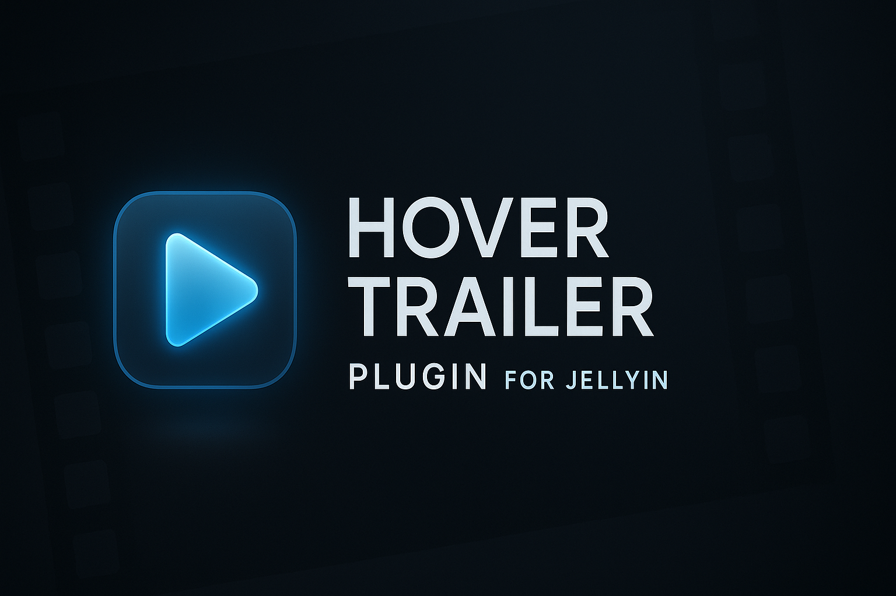
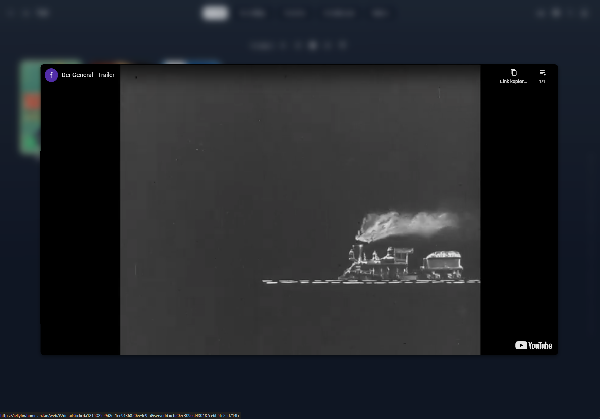
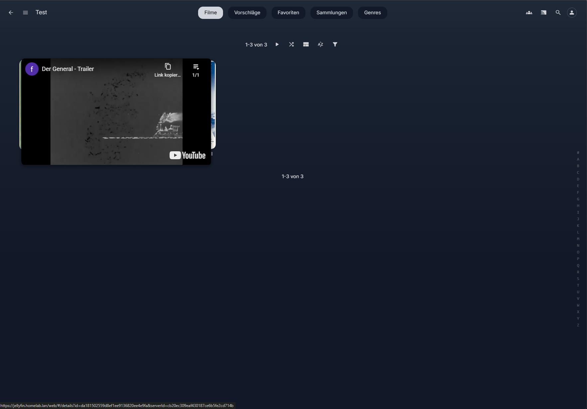
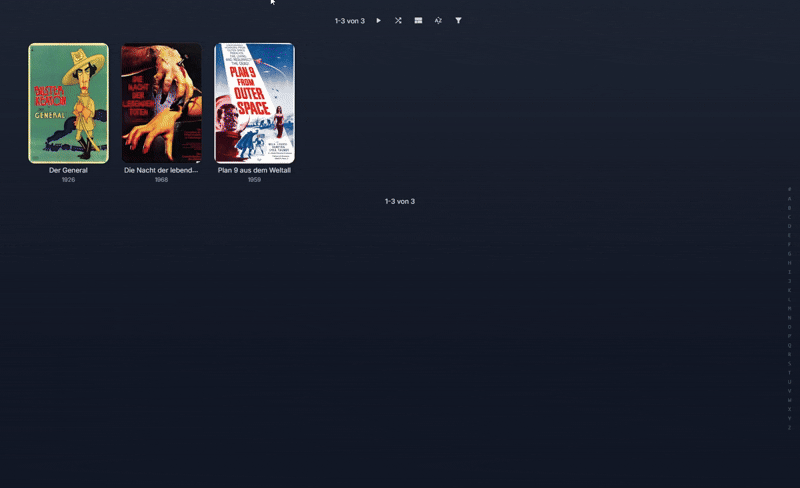
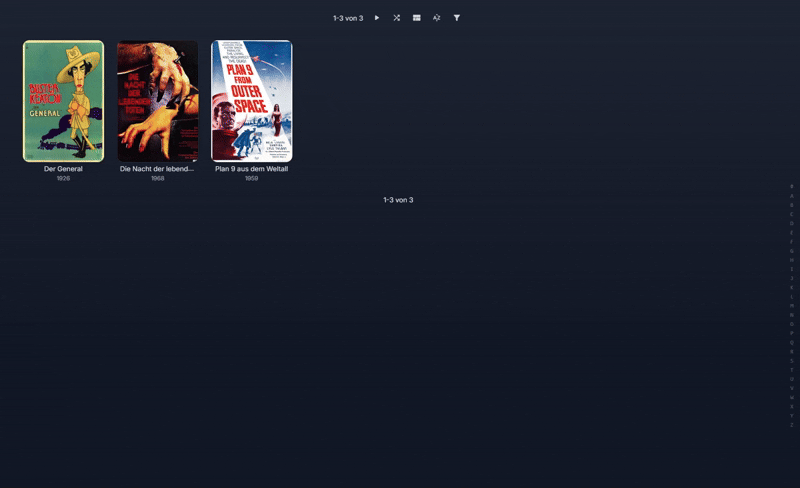

# HoverTrailer

<div align="center">
    <p>
        
    </p>
    <p>
        Bring your library to life: Instant trailer playback on hover for Jellyfin.
    </p>

[](https://github.com/Fovty/HoverTrailer/actions/workflows/build.yml)
[](https://github.com/Fovty/HoverTrailer/actions/workflows/codeql.yml)
<a href="https://github.com/Fovty/HoverTrailer/releases">

</a>
</div>

## Preview

<div align="center">
<table>
<tr>
<td align="center">

<sub>Configuration 1 - Centered Positioning, Background Blur, Higher Scaling, No Offset</sub>



</td>
<td align="center">

<sub>Configuration 2 - Custom Positioning, No Blur, Lower Scaling, Custom Offset</sub>



</td>
</tr>
</table>

<details>
<summary>▶️ <b>Show Preview Videos</b></summary>
<br/>

**Configuration 1**



**Configuration 2**



</details>

</div>

## Manifest URL

```
https://raw.githubusercontent.com/Fovty/HoverTrailer/master/manifest.json
```

> **Recommended companion plugin:** install [File Transformation](https://github.com/IAmParadox27/jellyfin-plugin-file-transformation) (v2.2.1.0+) first. HoverTrailer auto-detects it and injects the client script through it instead of modifying files on disk.

## Features

**Playback**
- Netflix-style hover preview with configurable delay
- Multi-source trailer detection: local files, remote YouTube, and optional theme-video fallback
- Audio on/off with adjustable volume (muted during autoplay until the page has user activation — browser policy)
- Hover progress indicator on the card during the delay

**Positioning modes**
- **Center** — preview is centered in the viewport (default)
- **Custom** — preview is centered on the card with configurable offsets
- **Anchor to Card** — preview follows the card as the page scrolls (tethered)

**Sizing**
- **Fit to Content** (default) — matches the trailer's aspect ratio, scaled by a percentage you choose (50-1500%), clamped to 90% of the viewport
- **Manual** — fixed width and height in pixels
- Adjustable opacity and corner radius

**Background blur**
- **Off** / **Full** (uniform blur over the page) / **Halo** (dense blur right next to the preview, fading out over a configurable radius — hides distracting nearby posters without dimming the whole screen)

**Behavior options**
- **Persistent preview** — keep playing after the cursor leaves the card; dismiss with click, Escape, or by hovering a different card long enough for a new preview to start
- **Focus trigger** — keyboard/D-pad focus on a card triggers the preview (for Jellyfin Web in a TV browser or with spatial-navigation overlays). Mouse clicks don't re-trigger.

## Installation

### From Jellyfin Plugin Catalog (Recommended)
1. Open **Jellyfin Admin Dashboard**
2. Navigate to **Plugins** → **Manage Repositories**
3. Click **+ (Add)** to add a new repository
4. Enter the **Manifest URL**:
   ```
   https://raw.githubusercontent.com/Fovty/HoverTrailer/master/manifest.json
   ```
5. Click **Save**
6. Navigate back to **Plugins**
7. Search for **"HoverTrailer"**
8. Click **Install**
9. **Restart Jellyfin server** to activate the plugin
10. Open **Plugins** → **HoverTrailer** → **Settings** to configure (every option has an inline description)

### Manual Installation
1. Download the latest release from [GitHub Releases](../../releases)
2. Extract the `.dll` file to your Jellyfin plugins directory:
   - **Windows**: `%ProgramData%\Jellyfin\Server\plugins\HoverTrailer`
   - **Linux**: `/var/lib/jellyfin/plugins/HoverTrailer`
   - **Docker**: `/config/plugins/HoverTrailer`
3. Restart Jellyfin server

## Known limitations

- **Touch devices**: hover is a pointer-only gesture, so the plugin disables itself on phones and tablets (UA sniff + `(hover: none)`).
- **Native mobile / TV apps**: Jellyfin's native mobile and smart-TV apps don't load the web frontend, so the plugin has no effect there. Focus Trigger covers the Jellyfin-Web-in-a-TV-browser case.
- **If audio is enabled**, the first hover after a fresh page load still plays **muted**. Chrome and Safari block unmuted autoplay until you interact with the page once — click anywhere and all subsequent hovers have audio.
- **YouTube iframe aspect ratio** is hardcoded to 16:9. The YouTube iframe is cross-origin so the actual video aspect can't be read.

## Troubleshooting

### Trailers not playing
1. **Check trailer availability** — confirm the movie has a trailer URL or local trailer file in Jellyfin.
2. **Enable Debug Logging** and watch the browser console (F12) for `[HoverTrailer]` lines.
3. **Audio**: if you expect sound on the first hover, click anywhere in Jellyfin once to grant the page user activation.

### Preview not showing
1. Confirm the plugin appears in the Jellyfin admin panel and is enabled.
2. **Hard reload** the page (Ctrl+Shift+R / Cmd+Shift+R) — the client script is cached by the browser.
3. Make sure you're on a desktop browser (phones and tablets skip the plugin by design).

### Docker permission issues
If you see `Access to the path '/usr/share/jellyfin/web/index.html' is denied`, install the [File Transformation](https://github.com/IAmParadox27/jellyfin-plugin-file-transformation) plugin (see the recommendation under [Manifest URL](#manifest-url)) — HoverTrailer will detect it and stop touching the web directory.

<details>
<summary>Manual alternatives if you can't use File Transformation</summary>

**Fix file permissions:**
```bash
docker exec -it jellyfin find / -name index.html
docker exec -it --user root jellyfin chown jellyfin:jellyfin /jellyfin/jellyfin-web/index.html
docker restart jellyfin
```

**Or bind-mount the file:**
```bash
docker cp jellyfin:/jellyfin/jellyfin-web/index.html /path/to/jellyfin/config/index.html
# then in docker-compose.yml:
volumes:
  - /path/to/jellyfin/config/index.html:/jellyfin/jellyfin-web/index.html
```
</details>

## Development

```bash
git clone https://github.com/Fovty/HoverTrailer.git
cd hovertrailer
# StyleCop warnings are treated as errors in CI; suppress locally:
dotnet build --configuration Release --property:TreatWarningsAsErrors=false
```

Contributions welcome — fork, branch, PR. Match the existing code style, update docs alongside any configuration change, and test across browsers / Jellyfin versions.

## License

This project is licensed under the MIT License - see the [LICENSE](LICENSE) file for details.

## Acknowledgments

- **Jellyfin Team** - For the excellent media server platform
- **IntroSkipper Plugin** - Architecture and CI/CD inspiration
- **Jellyscrub Plugin** - Configuration UI patterns

## Support

- **Issues**: [GitHub Issues](../../issues)
- **Discussions**: [GitHub Discussions](../../discussions)
- **Jellyfin Community**: [Official Jellyfin Forums](https://forum.jellyfin.org/)

---

**Note**: This plugin is not officially affiliated with Jellyfin or Netflix. It's a community-developed enhancement for the Jellyfin media server.
